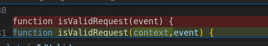
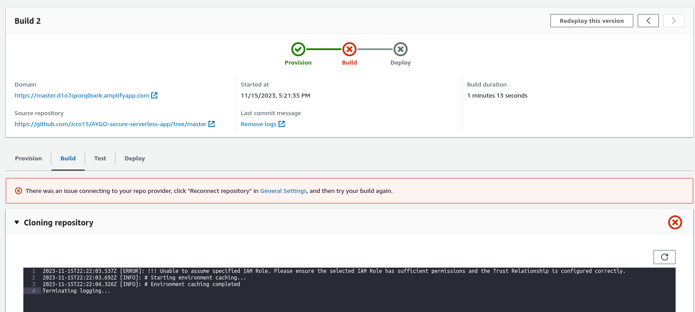
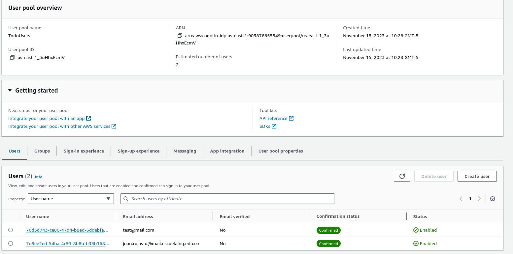
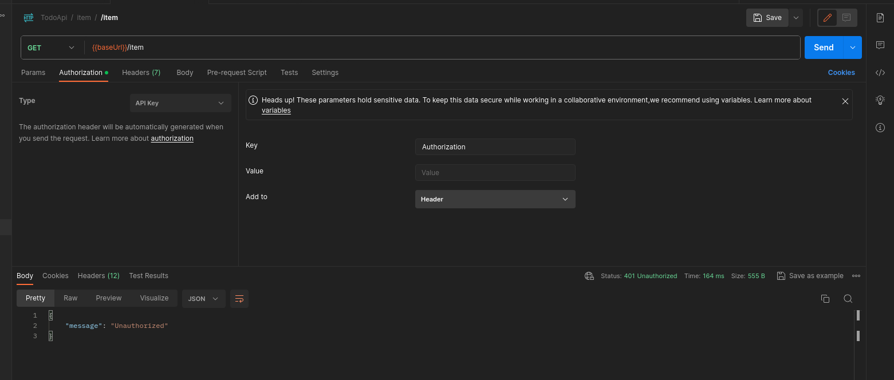
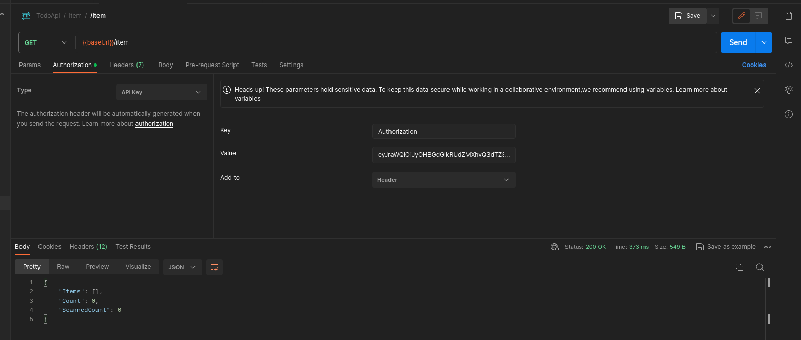
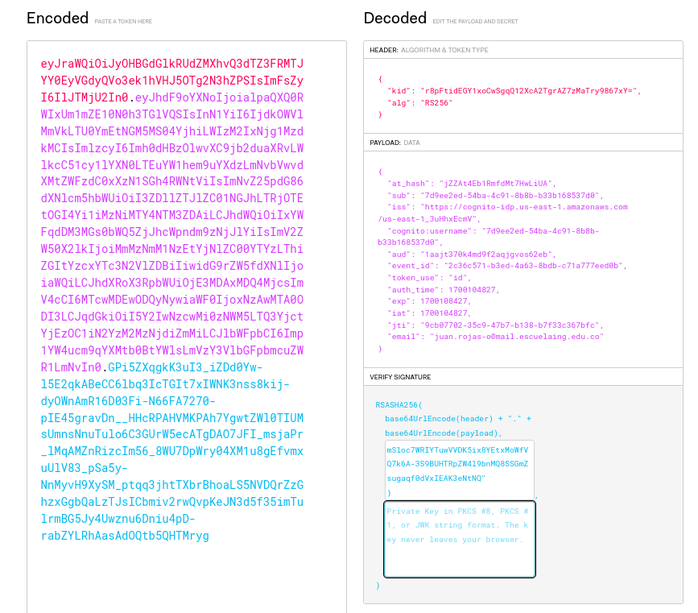

# AYGO - SECURITY WORKSHOP - Serverless Reference Architecture: Web Application


## Introduction
The Web Application reference architecture is a general-purpose, event-driven, web application back-end that uses [AWS Lambda](https://aws.amazon.com/lambda), [Amazon API Gateway](https://aws.amazon.com/apigateway) for its business logic. It also uses [Amazon DynamoDB](https://aws.amazon.com/dynamodb) as its database and [Amazon Cognito](https://aws.amazon.com/cognito) for user management. All static content is hosted using [AWS Amplify Console](https://aws.amazon.com/amplify/console).

This application implements a simple To Do app, in which a registered user can create, update, view the existing items, and eventually, delete them.

## Architectural Diagram


## Workshop results

### Code modifications
The following change was necessary in the functions completeTodo, deleteTodo, getTodo, and updateTodo. The validation was being called using both the context and the event, while the method's signature expected only the event. This caused an error when trying to obtain the pathParameters.



### Limitations creating roles in the environment
To make the experiment work in the test environment, it was necessary to modify the [AWS SAM template](./template.yml) provided by the lab. The roles that were being created had to be removed, and it was defined that the created lambdas should use the LabRole. Additionally, it was also necessary to remove the policies that were being added to avoid problems when creating the stack.

### Stack deployment :
Once the necessary modifications were made to the template, it was possible to successfully create the stack.

### Deployment Issues with Amplify
 Due to the constraints of the testing environment, problems arose with the use of Amplify. While it was possible to create resources using SAM and the template provided by the lab, the lack of permissions for the provided role made it impossible to use it to deploy the application's front-end. As a result, tests were conducted with the front-end locally.

 

 ### Application Testing
 As shown by the proposed architecture, the application uses Cognito to validate that only registered users can use the application and also to ensure that each user can only see the todos they have created. DynamoDB is used for data persistence, and API Gateway orchestrates Cognito with Lambda functions. This way, there is no need to implement the user authentication and registration features; instead, these responsibilities are handled by Cognito and the integration with API Gateway.

 All endpoints are secured, and it is necessary to use the token generated by Cognito at the time of authentication to access these endpoints. Additionally, the information within the token is used to access each user's data

 The use of JWT tokens enables applying security to a distributed architecture, as demonstrated in this workshop.

 As mentioned earlier, the tests were conducted by running the front end locally and pointing it to the deployed API Gateway. Below are the pieces of evidence demonstrating the application in operation.

**Created Users**



**Application Demo**

https://github.com/Jcro15/AYGO-secure-serverless-app/assets/45981880/c4b45aa2-cf72-4a88-bf17-6e5ab5f9fa5c

**Manual invocation without Auth token**



**Manual invocation with Auth token**



**Token Content**



## Application Components

The Web Application is built from 3 different components.

### Front End Application

The front-end application is all the static content (HTML files, CSS files, JavaScript files and images) that are generated by `create-react-app`. All these objects are hosted on AWS Amplify Console.

When a user connects to the web site, the needed resources are downloaded to their browser and start to run there. When the application needs to communicate with the backend it does so by issuing REST API calls to the backend.

### Back End Application (Business Logic)

The backend application is where the actual business logic is implemented. The code is implemented using Lambda functions fronted by an API Gateway REST API. In our case, we have different Lambda functions, each handling a different aspect of the application: list the to-do items, get details about a specific item, update an item, create a new item, mark an item as complete and delete an existing item. The application saves all items in a DynamoDB table.

### User Registration and Authentication

As the ToDo application contains personal information (the user's ToDo items), access is restricted only to registered and authenticated users. Each user can access only their own items.

To accomplish this, we are using Cognito User Pools, which allows users to register to the application, authenticate and so on. Only after a user is authenticated, the client will receive a JWT token which it should then use when making the REST API calls.

## Running the Example

Fork this repository to your own GitHub account, as you will need to create a Personal Access Token in Github for the Amplify console, as well as provide your GitHub repository URL in the deployment.

You can use the provided [AWS SAM template](./template.yml) to launch a stack that shown here on this Serverless reference architecture. Details about the resources created by this template are provided in the *SAM Template Resources* section of this document.

## Generating your Github Access Token

In order for use the Amplify Console, you need to generate a personal access token.
Once created, an access token should be stored in a safe place, as it may not be available to be seen the next time and may need to regenerate a new one again.
In order to setup your access token, go to [New personal access page](https://github.com/settings/tokens/new) in GitHub.

Note that you might need to enter your password in order to proceed.

### Using SAM and the Amplify Console to Build and Deploy the Full Stack Application

You can deploy the full stack application using the deployment script:

```bash
export AWS_DEFAULT_REGION=<your preferred region, i.e. us-east-1>
export STACK_NAME=<a unique name for your CloudFormation stack>
./deploy.sh
```

The script will use the SAM CLI to build your backend functions, and then the guided deployment feature of the SAM CLI for the initial backend deployment. You will be prompted for a set of parameters, and can accept the defaults for all parameters with the exception of the GitHub Repository URL and the GitHub OAuth token.

### Building the Application Step by Step

Alternatively, you could run the build steps yourself in the CLI:

#### Build the backend functions

The AWS SAM CLI comes with abstractions for a number of Lambda runtimes to build your dependencies, and copies the source code into staging folders so that everything is ready to be packaged and deployed. The `sam build` command builds any dependencies that your application has, and copies your application source code to folders under aws-sam/build to be zipped and uploaded to Lambda.

```bash
sam build --use-container
```

#### Package the backend

Next, run *sam package*.  This command takes your Lambda handler source code and any third-party dependencies, zips everything, and uploads the zip file to your Amazon S3 bucket. That bucket and file location are then noted in the packaged.yaml file. You use the generated `packaged.yaml` file to deploy the application in the next step.

```bash
sam package \
    --output-template-file packaged.yml \
    --s3-bucket $DEPLOYMENT_BUCKET
```

#### Deploy the backend

This command deploys your application to the AWS Cloud. It's important that this command explicitly includes both of the following:

* The AWS Region to deploy to. This Region must match the Region of the Amazon S3 source bucket.

* The CAPABILITY_IAM parameter, because creating new Lambda functions involves creating new IAM roles.

```bash
sam deploy \
    --template-file packaged.yml \
    --stack-name $STACK_NAME \
    --capabilities CAPABILITY_IAM
```

#### Testing locally (Optional)

To run lambda function , API Gateway and dynamodb locally follow the steps

To run the dynamodb table locally

```bash
docker run -p 8000:8000 amazon/dynamodb-local
```

Create a table in local Dynamodb environment

```bash
aws dynamodb create-table --table-name TodoTable --attribute-definitions AttributeName=id,AttributeType=S --key-schema AttributeName=id,KeyType=HASH --billing-mode PAY_PER_REQUEST --endpoint-url http://127.0.0.1:8000
```

Run the sam local module to test the application locally

```bash
sam local start-api --env-vars todo-src/test/environment/mac.json
```

Sample file of mac os is `todo-src/test/environment/mac.json`

#### Updating the Front-End Application

Once you deploy the infrastructure using SAM you will need to create a configuration file for your front-end web application. You can view the necessary values by describing your deployed stack:

```bash
aws cloudformation describe-stacks --stack-name $STACK_NAME --query "Stacks[0].Outputs[]"
```

Copy the default config file and update the values from the output above:

```bash
cp www/src/config.default.js www/src/config.js
```

You can run the front end locally for testing by setting the `redirect_url` value to `https://localhost:8080` and running:

```bash
cd www/src
npm start
```

You can run the front end locally for testing and use the local api by setting the `api_base_url` value to `http://127.0.0.1:8080`

#### Deploy the frontend

Deploy your application by checking in your update to the `config.js` file and pushing that commit to your repo. Amplify Console will automatically deploy the update from there.

```bash
git add www/src/config.js
git commit -m 'Update frontend config'
git push
```

You can view the deployment process in the Amplify Console web console.

## Cleaning Up the Example Resources

### Delete the CloudFormation Stack

```bash
aws cloudformation delete-stack \
--stack-name $STACK_NAME
```

### Delete the CloudWatch Log Groups

```bash
for log_group in $(aws logs describe-log-groups --log-group-name-prefix '/aws/lambda/'$STACK_NAME --query "logGroups[*].logGroupName" --output text); do
  echo "Removing log group ${log_group}..."
  aws logs delete-log-group --log-group-name ${log_group}
  echo
done
```

## SAM Template Resources

### Resources

[The provided template](./template.yaml)
creates the following resources:

* **TodoUserPool** - A Cognito UserPool that holds all the application users

* **TodoUserPoolTokenClient** - A Cognito UserPool Client used by the web application

* **TodoDomain** - The Cognito UserPool domain name

* **TodoTable** - The DynamoDB table used to hold all the ToDo items for all users

* **TodoApi** - The REST API that is used to expose the ToDo application functionality

* **GetTodoFunction** - The Lambda function used to retrieve a single ToDo item

* **GetAllTodoFunction** - The Lambda function used to retrieve all the ToDo items

* **CompleteTodoFunction** - The Lambda function used to set the state of an item to complete

* **AddTodoFunction** - The Lambda function used to create a new ToDo item

* **UpdateTodoFunction** - The Lambda function used to update the content of a ToDo item

* **DeleteTodoFunction** - The Lambda function used to delete a ToDo item

* **ApiAccessLogGroup** - The CloudWatch Logs Log Group used by API Gateway for its log messages

* **AmplifyApp** - Amplify Console application that will manage deployment of frontend updates based on pushes to GitHub

* **AmplifyBranch** - Connecting a GitHub branch to the Amplify Console application
